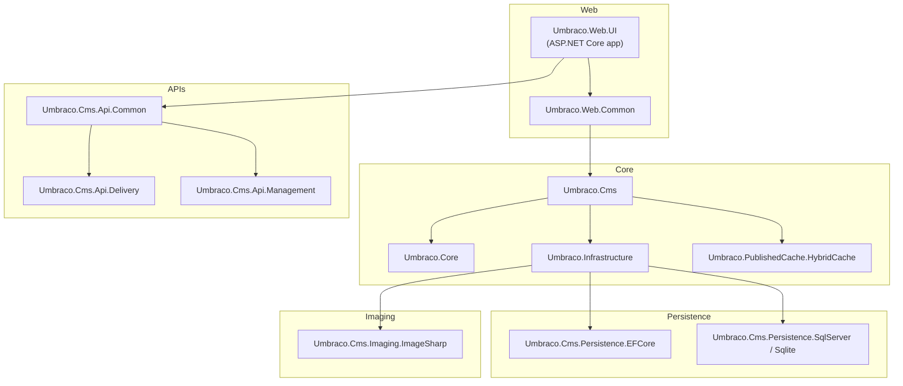

# Umbraco CMS Architecture

The Umbraco CMS application is composed of multiple projects organized around core functionality, web UI, APIs, and persistence layers. The diagram below highlights the main components and how they relate to each other at a high level.

This diagram presents a simplified overview. The `Umbraco.Web.UI` project hosts the ASP.NET Core application and depends on web-specific components in `Umbraco.Web.Common`. The CMS core functionality is provided by `Umbraco.Cms`, `Umbraco.Core`, `Umbraco.Infrastructure`, and caching implementations in `Umbraco.PublishedCache.HybridCache`. API projects provide REST endpoints for management and delivery scenarios, while persistence projects implement data storage via Entity Framework Core and database-specific providers. Imaging support is handled by projects such as `Umbraco.Cms.Imaging.ImageSharp`.

